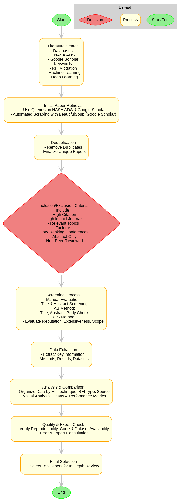

# RFI Mitigation in Radio Astronomy Using Machine Learning and AI

   

---
*This project is ongoing and subject to continuous advancements and modifications.*
----


-----


## Project Overview

The objective of this project is to explore and develop **machine learning (ML)** and **artificial intelligence (AI)** techniques for the detection and removal of **radio frequency interference (RFI)** in raw data obtained from radio telescopes.  
RFI, which generally originates from terrestrial sources such as communication systems and broadcasting services, often manifests as strong signals within certain frequency channels, though broadband RFI can also occur.  

A **review paper** inspired by [Ndung’u et al. (2023)](https://www.sciencedirect.com/science/article/pii/S1387647323000131) is currently being prepared and will be submitted to *New Astronomy Reviews*. This work may also include benchmarking of widely used ML models on representative datasets.  

Looking ahead, we intend to design and implement our **own ML model** for effective RFI detection and mitigation.

-----


Radio Frequency Interference (RFI) significantly hampers radio astronomy by contaminating observational data. Traditional mitigation methods are often inadequate due to increasing data complexity. This repository presents a detailed review of RFI mitigation strategies in radio astronomy, focusing on Machine Learning (ML) and Artificial Intelligence (AI). Through literature review, comparative analysis, and practical implementation, this work highlights how ML and AI can improve RFI mitigation processes. 

*This repository is designed to store the contents and showcase different aspects of our review on this subject.*


Radio Frequency Interference (RFI) disrupts radio telescopes and has become a growing challenge as electronic activity increases. Radio astronomy, which explores celestial objects through radio emissions, is highly sensitive to RFI from terrestrial and extraterrestrial sources, often leading to corrupted data and false detections. Traditional mitigation techniques, such as shielding, filtering, and time-frequency analysis, help but struggle to keep pace with the evolving RFI environment. Recent advances in Machine Learning (ML) and Artificial Intelligence (AI) offer more adaptable solutions, using large datasets and computational power to improve accuracy. Compared to traditional methods, ML and AI show clear advantages in effectiveness, scalability, and handling complex, high-dimensional data.


## Survey Methodology

### Literature Search and Selection

- **NASA/ADS** and **Google Scholar** were used to search for papers related to RFI, ML, AI, and neural networks.
- **Initial results**: NASA/ADS yielded 81 papers, and Google Scholar provided 1,337 unique papers after filtering.

### Inclusion and Exclusion Criteria

- **Inclusion**: Focus on ML/AI for RFI, peer-reviewed, and published from 2014 to 2024.
- **Exclusion**: Irrelevant topics, low-quality publications, and duplicates.




### Data Extraction and Analysis

Data were extracted from selected papers and categorized by techniques, algorithms, evaluation metrics, and datasets. The analysis helped in comparing the effectiveness of different RFI mitigation strategies.


## Future Work

Further research aims at developing more robust ML models, real-time mitigation techniques, and interdisciplinary collaborations for effective RFI management. Expanding open-access datasets and creating standardized benchmarks are also priorities.

## Extended Outline

The extended outline is available [here](Extended_Outline.md).


## Project Structure

- **notebooks/**: Contains Jupyter notebooks for analysis.
- **data/**: Placeholder for datasets used in the project.
- **scripts/**: Scripts for data preprocessing and model training.
- **reports/**: Generated analysis reports and visualizations.
- **assets/**: Images, logos, and other visual resources used in the project.
- **diagrams/**: Project-related diagrams to illustrate concepts and processes.
- **preprints/**: Preprint versions of research papers.
- **presentations/**: Presentation slides for project communication.
- **research_papers/**: A collection of related research papers.
- **tables/**: Data tables used in the analysis.
- **journals_conferences/**: List of journals and conferences related to the research.

```bash
├── assets/
│   ├── images/          # Images, logos, and other visual resources
│   └── diagrams/        # Project-related diagrams illustrating concepts and processes
├── data/                # Datasets used in the project
├── notebooks/           # Jupyter notebooks for analysis and experimentation
├── scripts/             # Scripts for data preprocessing, model training, and utilities
├── reports/
│   ├── analysis/        # In-depth analysis reports and visualizations
│   ├── appendices/      # Supporting documents and detailed data or methods
│   │   ├── Appendix_A/
│   │   ├── Appendix_B/
│   │   └── Appendix_C/
│   └── references/      # Reference documents and sources cited in the project
├── preprints/           # Preprint versions of research papers
├── presentations/       # Presentation slides for project communication
├── research_papers/     # Collection of related research papers
├── tables/              # Data tables used in the analysis
└── journals_conferences/ # List of journals and conferences related to the research
```

## References

- [Interference from a Busy Planet - NRAO Public Blogs](https://public.nrao.edu/blogs/interference-from-a-busy-planet/)
- [NRAO Spectrum Management - RFI Monitoring and Mitigation](https://info.nrao.edu/do/spectrum-management/rfi-monitoring-and-mitigation)
- [AAS COMPASSE - Radio Frequency Interference](https://compasse.aas.org/issues/radio-frequency-interference/)
- [NRAO - Radio Frequency Interference Overview](https://legacy.nrao.edu/epo/aoc/puente/rfi/#:~:text=However%2C%20transmitters%20using%20frequencies%20near,frequencies%20outside%20its%20intended%20range)
- [NRAO Telescopes - Radio Frequency Interference](https://public.nrao.edu/telescopes/radio-frequency-interference/)
- [Radio Interference from Satellites is Threatening Astronomy](https://www.astronomy.com/science/radio-interference-from-satellites-is-threatening-astronomy)
- [SpaceNews - Radio Noise from Satellite Constellations Could Interfere with Astronomers](https://spacenews.com/radio-noise-from-satellite-constellations-could-interfere-with-astronomers/)
- [Radio Interference from Satellites is Threatening Astronomy - Proposed Zone for Testing New Technologies](https://theconversation.com/radio-interference-from-satellites-is-threatening-astronomy-a-proposed-zone-for-testing-new-technologies-could-head-off-the-problem-199353)


## License

This project is licensed under the MIT License. See the [LICENSE](LICENSE) file for details.


## Contact

**For any inquiries or feedback, please contact:**

**Adrita Khan**  
[Email](mailto:adrita.khan.official@gmail.com) | [LinkedIn](https://www.linkedin.com/in/adrita-khan) | [Twitter](https://x.com/Adrita_)


